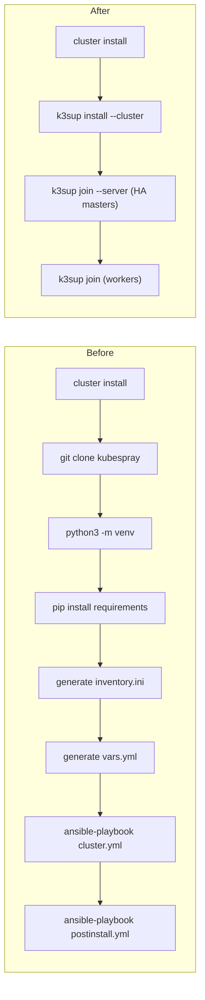

# Replace Kubespray with k3sup

## Context

Currently, `rock8s cluster install/upgrade/scale/reset/node rm` all work by cloning the upstream Kubespray repo (v2.24.0) at runtime, creating a Python venv, installing Ansible, generating inventory files, and running `ansible-playbook` against various Kubespray playbooks. This is slow, brittle, and heavyweight.

k3sup is a single Go binary (7k+ stars, MIT, actively maintained since 2019) that installs k3s over SSH. It replaces the entire Kubespray flow with simple CLI calls that can be wrapped in POSIX shell scripts.

## Architecture Change



## Key Decisions

- **CNI**: Switch from Calico (Kubespray) to Flannel (k3s default, also VXLAN). Simpler, k3s-native, no extra configuration needed.
- **Built-in addons**: k3s includes metrics-server by default. Disable Traefik and ServiceLB via `--disable traefik --disable servicelb` (the existing addons flow handles ingress/LB).
- **MetalLB**: Move from Kubespray vars to the existing addons Terraform flow.
- **cert-manager, dashboard**: Move from Kubespray vars to the existing addons Terraform flow.
- **TLS SANs**: `supplementary_addresses_in_ssl_keys` maps directly to `--tls-san` flag.
- **postinstall.yml**: The hook that runs `/tmp/postinstall.sh` if present can be replaced by a simple SSH command after install.
- **k3sup dependency**: Add k3sup as a system requirement (like tofu/terraform). No vendoring needed -- it's a single static binary.

## Feature Mapping: Kubespray vars.yml to k3s

| Kubespray var | k3s equivalent |
|---|---|
| `kube_version: v1.28.6` | `K3S_VERSION` env var / `--k3s-version` flag |
| `kube_network_plugin: calico` | Flannel (k3s default) |
| `calico_network_backend: vxlan` | `--flannel-backend=vxlan` (default) |
| `calico_mtu` / `calico_veth_mtu` | Flannel auto-detects MTU |
| `metallb_enabled` + config | Move to addons Terraform |
| `cert_manager_enabled` | Move to addons Terraform |
| `dashboard_enabled` | Move to addons Terraform |
| `helm_enabled` | k3s includes helm controller by default |
| `metrics_server_enabled` | k3s includes metrics-server by default |
| `supplementary_addresses_in_ssl_keys` | `--tls-san` per address |
| `nat_outgoing` / `nat_outgoing_ipv6` | Flannel handles NAT by default |
| `enable_dual_stack_networks` | `--cluster-cidr` + `--service-cidr` with dual CIDRs |

## Files to Change

### Remove

- [kubespray/vars.yml](kubespray/vars.yml) -- entire file
- [kubespray/postinstall.yml](kubespray/postinstall.yml) -- entire file
- [lib/kubespray.sh](lib/kubespray.sh) -- replaced by k3s.sh

### Rewrite

- [libexec/cluster/install.sh](libexec/cluster/install.sh) -- k3sup install + join flow
- [libexec/cluster/upgrade.sh](libexec/cluster/upgrade.sh) -- SSH-based k3s upgrade
- [libexec/cluster/scale.sh](libexec/cluster/scale.sh) -- k3sup join for new nodes
- [libexec/cluster/reset.sh](libexec/cluster/reset.sh) -- SSH + k3s-uninstall.sh
- [libexec/cluster/node/rm.sh](libexec/cluster/node/rm.sh) -- kubectl drain/delete + SSH uninstall

### Modify

- [libexec/cluster.sh](libexec/cluster.sh) -- replace `KUBESPRAY_VERSION`/`KUBESPRAY_REPO` with `K3S_VERSION`/`K3S_CHANNEL`
- [libexec/cluster/apply.sh](libexec/cluster/apply.sh) -- rename `--skip-kubespray` to `--skip-k3s`, update `_SKIP_KUBESPRAY` to `_SKIP_K3S`
- [lib/lib.sh](lib/lib.sh) -- source `lib/k3s.sh` instead of `lib/kubespray.sh`
- [libexec/nodes/destroy.sh](libexec/nodes/destroy.sh) -- update cleanup: `rm -rf "$_CLUSTER_DIR/kubespray"` no longer needed
- [Makefile](Makefile) -- remove `kubespray` install directory and copy targets

### Create

- `lib/k3s.sh` -- helper functions (e.g. `get_k3s_extra_args`, build `--tls-san` list)

### Update Standards/Docs

- [agent-os/standards/global/architecture.md](agent-os/standards/global/architecture.md) -- update stack table (Kubespray -> k3sup), update repo layout
- [agent-os/standards/shell/variable-naming.md](agent-os/standards/shell/variable-naming.md) -- `_SKIP_KUBESPRAY` example -> `_SKIP_K3S`
- [agent-os/standards/providers/purpose-based-infra.md](agent-os/standards/providers/purpose-based-infra.md) -- remove Kubespray migration note
- [project-words.txt](project-words.txt) -- add k3sup, k3s

## install.sh Sketch

```sh
K3S_VERSION="${K3S_VERSION:-v1.31.4+k3s1}"

_MASTER_IPS="$(get_master_private_ips)"
_FIRST_MASTER="$(echo "$_MASTER_IPS" | head -1)"
_MASTER_SSH_KEY="$(get_master_ssh_private_key)"
_WORKER_IPS="$(get_worker_private_ips)"
_WORKER_SSH_KEY="$(get_worker_ssh_private_key)"
_TLS_SANS="$(get_supplementary_addresses)"
_EXTRA_ARGS="--disable traefik --disable servicelb"
_DUAL_STACK="$(get_enable_network_dualstack)"

# Install first server (HA init)
k3sup install \
  --ip "$_FIRST_MASTER" \
  --user admin \
  --ssh-key "$_MASTER_SSH_KEY" \
  --cluster \
  --k3s-version "$K3S_VERSION" \
  --k3s-extra-args "$_EXTRA_ARGS --tls-san $_TLS_SANS" \
  --local-path "$(get_cluster_dir)/kube.yaml"

# Join remaining masters
for _IP in $(echo "$_MASTER_IPS" | tail -n +2); do
  k3sup join --ip "$_IP" --server-ip "$_FIRST_MASTER" \
    --user admin --ssh-key "$_MASTER_SSH_KEY" \
    --server --k3s-version "$K3S_VERSION" \
    --k3s-extra-args "$_EXTRA_ARGS"
done

# Join workers
for _IP in $_WORKER_IPS; do
  k3sup join --ip "$_IP" --server-ip "$_FIRST_MASTER" \
    --user admin --ssh-key "$_WORKER_SSH_KEY" \
    --k3s-version "$K3S_VERSION"
done
```

## reset.sh Sketch

```sh
# Uninstall agents first, then servers
for _IP in $_WORKER_IPS; do
  ssh -i "$_WORKER_SSH_KEY" admin@"$_IP" \
    "/usr/local/bin/k3s-agent-uninstall.sh" 2>/dev/null || true
done
for _IP in $_MASTER_IPS; do
  ssh -i "$_MASTER_SSH_KEY" admin@"$_IP" \
    "/usr/local/bin/k3s-uninstall.sh" 2>/dev/null || true
done
```

## node/rm.sh Sketch

```sh
export KUBECONFIG="$(get_cluster_dir)/kube.yaml"
kubectl drain "$_NODE" --ignore-daemonsets --delete-emptydir-data --force
kubectl delete node "$_NODE"
# Then SSH to uninstall the agent
ssh -i "$_SSH_KEY" admin@"$_NODE_IP" "/usr/local/bin/k3s-agent-uninstall.sh"
```

## Risk Mitigation

- **k3sup availability**: k3sup is a dependency like tofu. If it's missing, `install.sh` should `fail "k3sup is required"` early.
- **Flannel vs Calico**: Flannel is simpler and k3s-native. If Calico is needed later, it can be installed via `--flannel-backend=none` + addon.
- **MTU**: Flannel auto-detects MTU. If custom MTU is needed, pass `--flannel-iface` or configure via k3s config file.
- **Dual-stack**: k3s supports dual-stack via `--cluster-cidr 10.42.0.0/16,fd00:42::/56 --service-cidr 10.43.0.0/16,fd00:43::/112`.
- **postinstall hook**: If still needed, replace with a simple SSH loop after install.
